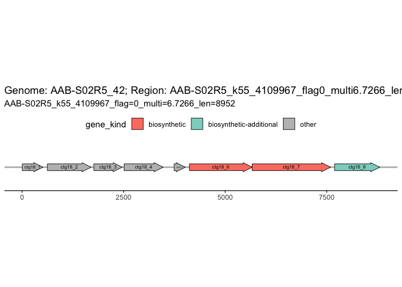
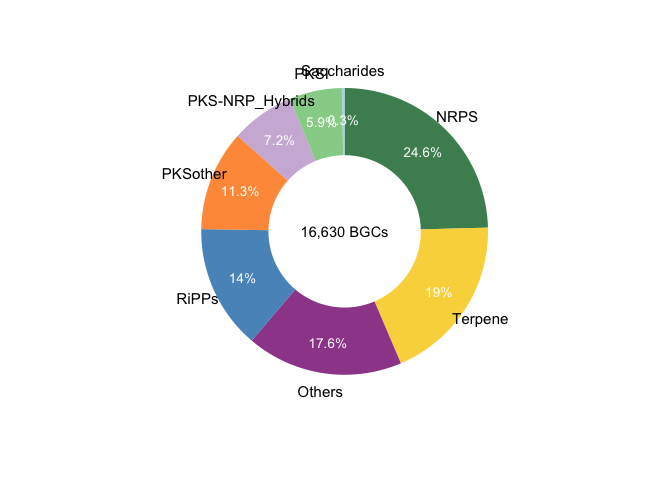
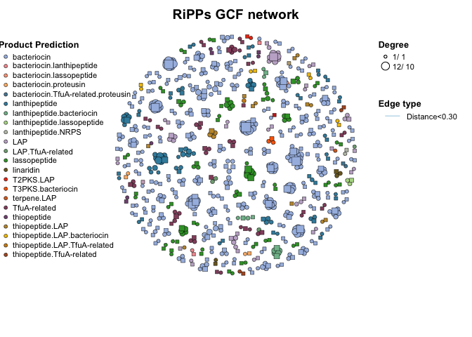

<!-- README.md is generated from README.Rmd. Please edit that file -->

# BGCkit

<!-- badges: start -->

<!-- badges: end -->

## Installation

You can install the development version of BGCkit like so:

``` r
# install.packages("devtools")
devtools::install_github("Asa12138/BGCkit")
```

## Example

This is a basic example which shows you how to solve a common problem:

``` r
library(BGCkit)
## basic example code
```

## MiBIG database

``` r
# get_mibig_db(file = "../temp/mibig_json_4.0.tar.gz")
load_mibig_db() -> mibig_db
mibig_db2df(mibig_db) -> mibig_df
```

## Antismash

``` r
how_to_do_bgc("antismash")
```

``` r
read_antismash_json("../temp/AAB-S02R5_42_v7.1.0/AAB-S02R5_42.json") -> AAB_S02R5_42
AAB_S02R5_42
#> Antismash Output Summary:
#> Genome name: AAB-S02R5_42 
#> Number of BGCs: 8 
#> Version: 7.1.0

get_BGCs_from_BGC_json(AAB_S02R5_42)
#>    genome_name                                              id
#> 1 AAB-S02R5_42 AAB-S02R5_k55_4109967_flag0_multi6.7266_len8952
#> 2 AAB-S02R5_42 AAB-S02R5_k55_5485772_flag0_multi4.5880_len2123
#> 3 AAB-S02R5_42 AAB-S02R5_k55_4875950_flag0_multi6.0838_len3658
#> 4 AAB-S02R5_42 AAB-S02R5_k55_2881803_flag0_multi6.5031_len6907
#> 5 AAB-S02R5_42 AAB-S02R5_k55_6300465_flag0_multi6.8636_len7457
#> 6 AAB-S02R5_42  AAB-S02R5_k55_216270_flag1_multi5.9327_len2521
#> 7 AAB-S02R5_42 AAB-S02R5_k55_4015141_flag0_multi5.4879_len6231
#> 8 AAB-S02R5_42 AAB-S02R5_k55_4042629_flag0_multi4.9108_len2130
#>                                               contig region_number
#> 1 AAB-S02R5_k55_4109967_flag=0_multi=6.7266_len=8952             1
#> 2 AAB-S02R5_k55_5485772_flag=0_multi=4.5880_len=2123             1
#> 3 AAB-S02R5_k55_4875950_flag=0_multi=6.0838_len=3658             1
#> 4 AAB-S02R5_k55_2881803_flag=0_multi=6.5031_len=6907             1
#> 5 AAB-S02R5_k55_6300465_flag=0_multi=6.8636_len=7457             1
#> 6  AAB-S02R5_k55_216270_flag=1_multi=5.9327_len=2521             1
#> 7 AAB-S02R5_k55_4015141_flag=0_multi=5.4879_len=6231             1
#> 8 AAB-S02R5_k55_4042629_flag=0_multi=4.9108_len=2130             1
#>   on_contig_edge start  end direct length              product
#> 1           True     1 8952      1   8952 proteusin; RiPP-like
#> 2           True     1 2123      1   2123              terpene
#> 3           True     1 3658      1   3658            RiPP-like
#> 4           True     1 6907      1   6907       redox-cofactor
#> 5           True     1 5328      1   5328            RiPP-like
#> 6           True     1 2521      1   2521              terpene
#> 7           True   596 6231      1   5636            RiPP-like
#> 8           True     1 2130      1   2130              terpene
#>                                                         BGC
#> 1 AAB-S02R5_k55_4109967_flag0_multi6.7266_len8952.region001
#> 2 AAB-S02R5_k55_5485772_flag0_multi4.5880_len2123.region001
#> 3 AAB-S02R5_k55_4875950_flag0_multi6.0838_len3658.region001
#> 4 AAB-S02R5_k55_2881803_flag0_multi6.5031_len6907.region001
#> 5 AAB-S02R5_k55_6300465_flag0_multi6.8636_len7457.region001
#> 6  AAB-S02R5_k55_216270_flag1_multi5.9327_len2521.region001
#> 7 AAB-S02R5_k55_4015141_flag0_multi5.4879_len6231.region001
#> 8 AAB-S02R5_k55_4042629_flag0_multi4.9108_len2130.region001
plot_BGC(AAB_S02R5_42, region_id = "AAB-S02R5_k55_4109967_flag0_multi6.7266_len8952.region001")
```



## Big-scape

``` r
how_to_do_bgc("big-scape")
```

``` r
read_big_scape_dir("../temp/network_files/2024-05-27_14-21-19_hybrids_glocal/") -> big_scape_res
#> Found 1 networks with different cutoff:
#> 0.30
#> Use the cutoff: 0.30
#> ================================Reading networks================================
#> ==================================Reading GCFs==================================
#> Joining with `by = join_by(GCF)`
#> Some BGCs such as 'AAB-S10R3_263_c00118_AAB-S10...region001' were assigned into
#> different GCFs
#> Reassign them into the GCF with the largest number of BGCs
#> Joining with `by = join_by(BGC)`
#> Some BGC names are in the format of BGCXXXXXXX (from MIBiG database)
big_scape_res
#> BiG-scape Output Summary:
#> Number of BGCs: 16630 
#> Cutoff: 0.30 
#> BiG-scape Classes: NRPS, Others, PKS-NRP_Hybrids, PKSI, PKSother, RiPPs, Saccharides, Terpene 
#> With MIBiG:  TRUE

plot_BGC_class(big_scape_res)
```



``` r

trans_net(big_scape_res, class = "RiPPs") -> NRPS_net
#> No 'from' and 'to' in the colnames(edgelist), use the first two columns as the 'from' and 'to'.

plot(NRPS_net,
  group_legend_title = "Product Prediction", main = "RiPPs GCF network",
  size_legend = T, size_legend_title = "Degree"
)
```



## Big-slice

``` r
# read_big_slice_dir("~/Documents/R/Greenland2/data/big_slice_out/")->big_slice_res2
read_big_slice_dir("../temp/big_slice_test_out/") -> big_slice_res
#> Joining with `by = join_by(bgc_id)`
#> Joining with `by = join_by(gcf_id)`

big_slice_res
#> BiG-slice Output Summary:
#> Dir: /Users/asa/Documents/R/BGC_analysis/temp/big_slice_test_out 
#> BGCs number: 4 
#> With 1 reports:
#>  Greenland_MAGs

# open_big_slice_website(big_slice_res,port=123)

get_big_slice_db(big_slice_res, "bgc")
#>   id dataset_id                                     name type on_contig_edge
#> 1  1          1 AAB-S01R1_115/c00076_AAB-S01...region001  as5              1
#> 2  2          1 AAB-S01R1_115/c00291_AAB-S01...region001  as5              1
#> 3  3          1 AAB-S01R1_115/c00189_AAB-S01...region001  as5              1
#> 4  4          1 AAB-S01R1_115/c00196_AAB-S01...region001  as5              1
#>   length_nt   orig_folder                  orig_filename
#> 1      1528 AAB-S01R1_115 c00076_AAB-S01...region001.gbk
#> 2      2578 AAB-S01R1_115 c00291_AAB-S01...region001.gbk
#> 3      1029 AAB-S01R1_115 c00189_AAB-S01...region001.gbk
#> 4      5330 AAB-S01R1_115 c00196_AAB-S01...region001.gbk

get_report_df(big_slice_res, "Greenland_MAGs")
#> Joining with `by = join_by(bgc_id)`
#>    bgc_id                                                name type
#> 1       1 test_query/AAB-S01R1_127_c00915_AAB-S01...region001  as5
#> 2       2 test_query/AAB-S01R1_127_c00921_AAB-S01...region001  as5
#> 3       3 test_query/AAB-S01R1_127_c00197_AAB-S01...region001  as5
#> 4       4 test_query/AAB-S01R1_127_c00519_AAB-S01...region001  as5
#> 5       5 test_query/AAB-S01R1_127_c00586_AAB-S01...region001  as5
#> 6       6 test_query/AAB-S01R1_127_c00102_AAB-S01...region001  as5
#> 7       7 test_query/AAB-S01R1_127_c00437_AAB-S01...region001  as5
#> 8       8 test_query/AAB-S01R1_127_c00276_AAB-S01...region001  as5
#> 9       9 test_query/AAB-S01R1_127_c00355_AAB-S01...region001  as5
#> 10     10 test_query/AAB-S01R1_127_c00212_AAB-S01...region001  as5
#>    on_contig_edge length_nt gcf_id distance in_gcf
#> 1               1      3790  GCF_1 1.375247  FALSE
#> 2               1      5018  GCF_1 1.375247  FALSE
#> 3               1      8284  GCF_3 1.198277  FALSE
#> 4               1      1584  GCF_1 1.375247  FALSE
#> 5               1      1701  GCF_1 1.375247  FALSE
#> 6               1     14587  GCF_1 1.375247  FALSE
#> 7               1      3371  GCF_1 1.375247  FALSE
#> 8               1      4403  GCF_3 1.326082  FALSE
#> 9               1      3075  GCF_1 1.375247  FALSE
#> 10              1      5435  GCF_1 1.375247  FALSE
```

## BGC_atlas

    cd /data/home/jianglab/share/pc_DB/BGC_atlas
